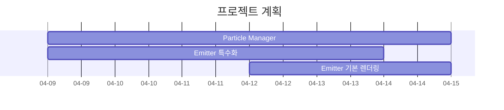

# Particle System을 활용한 효과 구현
## 주간 피드백 1회차
### 내용
1) 일시 : 25.03.31(월) ~ 25.04.08.(화)
2) 주간 프로젝트 진행사항
	1. 파티클 시스템 관련 자료 리서치 수행 
	2. 파티클에 대한 Emitter 클래스와 Manager 클래스를 설계(DirectX11, HLSL)
	3. 파티클 Pooling과 Defragmentation을 위한 Prefix Sum 구현  
	- 프로젝트 진행사항
		- Particle Pooling
			- Particle Manager가 최대 입자수 N에 대한 GPU 메모리를 미리 할당 해두고, 이에 대해서 여러 Emitter가 Index를 통하여 입자에 대해 접근하도록 구성
			- N개에 대한 입자를 Compute Shader를 통하여 확인하고, 죽은 입자의 인덱스를 Set D(AppendStructuredBuffer)에 Append하고, 살아있는 입자에 대한 Alive Flag 설정
			- Set D(ConsumeStructuredBuffer)를 Consume하여 얻은 인덱스에 Emitter에 대한 Sourcing 수행 및 Alive Flag 업데이트
			- Alive Flag 입력으로 설정하고 Blelloch 알고리즘과 Decoupled Look-back 방식을 활용하여 Prefix Sum을 구하고, 이를 바탕으로 파티클에 접근할 수 있는 Index Buffer를 설정
			
			- 현재 프레임에 대한 파티클 개수를 바탕으로 DrawInstancedIndirect 수행
			
	
4) 차주 프로젝트 계획 / 예정사항

	- 프로젝트 예정사항
		- Emitter Type에 따른 시뮬레이션 / 기본 렌더링 수행
			* Emitter Type 0 : 스파크
			* Emitter Type 1 : 에너지 영역
