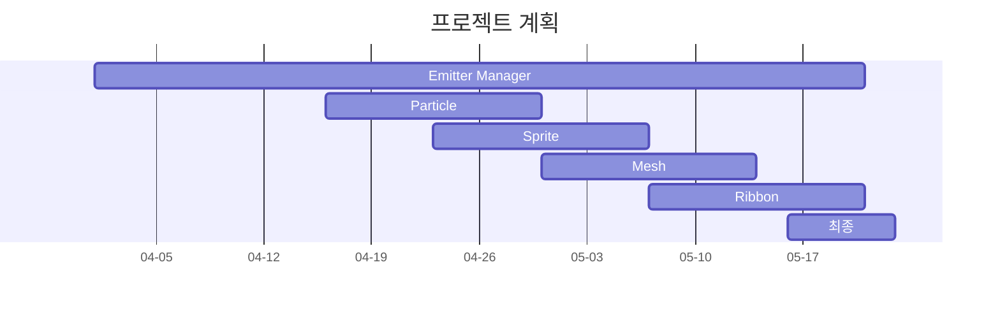
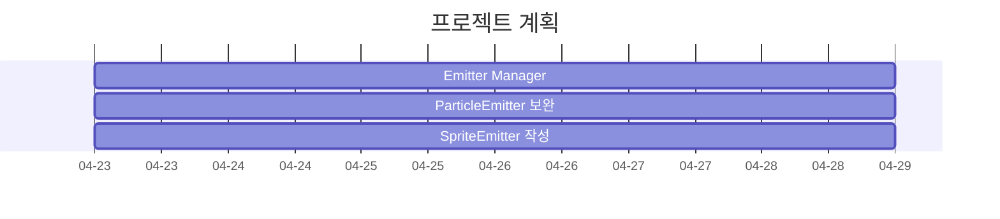


# Particle System을 활용한 효과 구현
## 주간 피드백 3회차
### 내용
1) 일시 : 25.04.16(수) ~ 25.04.22.(화)
2) 주간 프로젝트 진행사항
	1. 프로젝트 목표 수정(최종)
		- https://dev.epicgames.com/documentation/ko-kr/unreal-engine/how-to-create-a-sparks-effect-in-niagara-for-unreal-engine
		- 기존의 경우 '3D Particle Manager 설계'를 기반으로 한 참고 영상 구현이었는데, 이를 EmitterManager 설계와 Emitter 설계로 구체적으로 구분
			- EmitterManager의 경우 Emitter들을 관리하고, Emitter 들이 활용할 메모리 등을 관리
			- Emitter는 기능에 따라 4가지로 설계
				- Particle Emttier
				- Sprite Emitter
				- Mesh Emitter
				- Ribbon Emitter


3) Interpolater 템플릿 클래스 설계
	- 보간 : 어떠한 데이터의 프로파일이 이산적으로 주어져 있을 경우, 해당 프로파일을 활용하여 새로운 데이터 입력에서의 출력을 찾는 방법
	- 다항식으로 이산적으로 주어진 데이터를 연결하여 보간하는 다항식 보간법을 주로 활용
	- 다항식을 활용하되, 각 구간을 연결하는 지점에 대해 한번 미분 가능한지(C1 연속성), 두번 미분 가능한지(C2 연속성) 등에 따라 다양하게 표현이 가능
	- 데이터를 보간 방법하는 방법은 다양할 수 있으나, 동일한 인터페이스를 공유할 수 있으므로, 이를 활용하여 클래스 설계
	- 데이터의 형태는 입력 float x에 대한 출력 float y가 Dim 차원으로 존재할 수 있으므로 아래와 같이 작성
	```cpp 
	 template<uint32_t Dim>
	 struct SControlPoint
	 {
	 	float x = 0.f;
	 	std::array<float, Dim> y; // float y[Dim];
	 };
	```
	- `SControlPoint<Dim>`이 컨트롤 포인트로 주어졌을 때 데이터를 보간할 수 있는 인터페이스 클래스 작성
	```cpp
	 template<uint32_t Dim>
	 class IInterpolater
	 {
	 public:
	 	virtual void UpdateCoefficient() = 0;
	 	// 보간에 필요한 인자를 업데이트하는 인터페이스 함수
	 	virtual std::array<float, Dim> GetInterpolated(float x) noexcept = 0;
	 	// 입력 float x가 주어졌을 경우 출력 float y의 Dim 차원 데이터를 반환하는 함수
	 };
	```
	- 보간 방법에 따라 보간에 필요한 인자의 개수가 다르기 때문에, 인자의 수에 대한 템플릿 추상 클래스 작성
	```cpp
	 template<uint32_t Dim, size_t Multiplier = 2>
	 class AInterpolater : public IInterpolater<Dim>
	 {
	 public:
		 // 시작, 끝에 대한 ControlPoint를 명시적으로 생성자의 인자로 받아 최소한의 ControlPoint 확보 
	 	AInterpolater(
	 		const SControlPoint<Dim>& startPoint,
	 		const SControlPoint<Dim>& endPoint,
	 		const std::vector<SControlPoint<Dim>>& controlPoints
	 	);
	 	virtual ~AInterpolater() = default;

	 protected:
	 	const SControlPoint<Dim>& m_startPoint;
	 	const SControlPoint<Dim>& m_endPoint;
	 	const std::vector<SControlPoint<Dim>>& m_controlPoints;

	 protected:
	 	std::vector<float> m_xProfiles;
	 	using CoeffType = std::array<float, Multiplier * Dim>;
	 	std::vector<CoeffType> m_coefficients;
	...
	 };
	```
	- 위 추상 클래스를 보간 방법에 따라 구체화하는 클래스 작성
	```cpp
	 template<uint32_t Dim>
	 class LinearInterpolater : public AInterpolater<Dim, 2>
	 // Linear Interpolater는 ax + b 형태로 보간하므로 N = 2
	 
	 template<uint32_t Dim>
	 class CubicSplineInterpolater : public AInterpolater<Dim, 4>
	 // 테스트를 위해 Hermite 방식의 캣멀-롬 스플라인을 활용하여 at^3 + bt^2 + ct + d 형태로 보간하므로 N = 4
	``` 
	
	
4) AEmitter 설계
	- 이미터가 가질 수 있는 특징을 4개로 구분하여 클래스 작성(언리얼 엔진 참고)
	    -   BaseEmitterSpawnProperty
	        -   이미터 생성 시 초기 파티클에 대한 설정(초기 입자 위치, 초기 생성 개수, 초기 입자 생명주기 등)
	    -   BaseEmitterUpdateProperty
	        -   파티클을 방출하는 이미터에 대한 설정(방출 개수, 루프 설정 등)
	    -   BaseParticleSpawnProperty
	        -   파티클 생성시 가지는 물리량에 대한 설정(속도, 생명주기 등)
	    -   BaseParticleUpdateProperty
	        -   파티클에 작용하는 힘에 대한 설정(중력, 항력, Vortex 등)
5) ParticleEmitter 동작 
	1. 파티클 Pooling 단계(기존과 동일)
	2. 파티클 추가 단계
		- Emitter 마다 가지고 있는 프로퍼티(파티클 입자의 초기 위치, 속도 및 생성 위치, 속도를 관리하는 BaseEmitterSpawnProperty, BaseParticleSpawnProperty ConstantBuffer 등)의 버퍼를 GPU에 바인딩하여 이미터에 대한 파티클을 추가
		- 파티클에 EmitterID에 대한 정보를 가지도록 구성하여 시뮬레이션 과정에서 이미터에 대한 정보를 EmitterID로 인덱싱하여 확인할 수 있도록 구성
	3. 파티클 시뮬레이션 수행
		- 이미터에 작용하는 힘과 관련된 프로퍼티 `SEmitterForceProperty`를 StructuredBuffer로 관리하고, 이를 파티클이 가지고 있는 EmitterID 데이터로 인덱싱하여 접근
	```cpp
	struct SVortexForce
	{
		DirectX::XMFLOAT3 vortexOrigin;
		DirectX::XMFLOAT3 vortexAxis;
		float vortexRadius;
		float vortexDeathHorizonRadius;
		float vortextCoefficient;
		float vortexTightness;
	};

	struct SLineInteractionForce
	{
		DirectX::XMFLOAT3 lineInteractionOrigin;
		DirectX::XMFLOAT3 lineInteractionAxis;
		float interactionDistance;
		float interactionCoefficient;
	};

	struct SPointInteractionForce
	{
		DirectX::XMFLOAT3 pointInteractionCenter;
		float interactionRadius;
		float interactionCoefficient;
	};

	struct SEmitterForceProperty
	{
		UINT forceFlag;
		DirectX::XMFLOAT3 gravityForce;
		float dragCoefficient;
		float curlNoiseOctave;
		float curlNoiseCoefficient;
		UINT nForceCount;
		SVortexForce nVortexForce[MaxNForceCount];
		SLineInteractionForce nLineInteractionForce[MaxNForceCount];
		SPointInteractionForce nPointInteractionForce[MaxNForceCount];
	};
	```
	4. `forceFlag`를 비트 연산하여 특정 힘에 대한 플래그 여부를 확인하고, 힘을 적용하는 방식으로 구현
	```cpp
	StructuredBuffer<ForceProperty> emitterForces : register(t2);
	// 일부 내용 생략
	// ...
	// 
	const uint emitterID = currentParticle.emitterID;
	ForceProperty forceProperty = emitterForces[emitterID];
	uint forceFlag = forceProperty.forceFlag;
	
	uint gravityFlag = (forceFlag >> GravityFlag);
	if (gravityFlag & 1)
	{
		force += forceProperty.gravityForce;
	}
	if (dragFlag & 1)
	{
		force -= forceProperty.dragCoefficient * length(velocity) * velocity;
	}

	// 일부 내용 생략
	// ...
	// 
	```

6) 차주 프로젝트 계획 / 예정사항
- ParticleEmitter 관련 코드 보완 및 SpriteEmitter 작성 수행
	-  3차 스플라인 추가
		- 현재는 3차 Hermite 보간(Catmull–Rom)만 작성되어 있음
	- 점 인력, 선 인력 관련 코드 추가
	- 파티클을 Sprite 형태로 그리기 위한 기본 내용 확인


