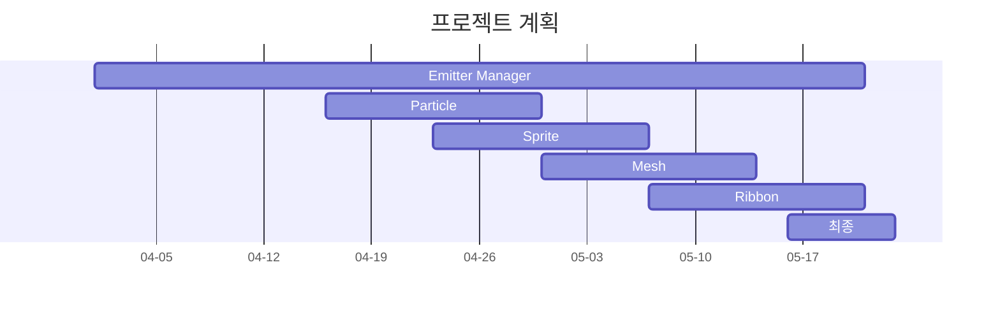


# Particle System을 활용한 효과 구현
 
##  List Up


### 기능 구현
1. Emitter Manager 구현
	- 여러 Emitter을 하나의 Manager가 관리하고, 각 Emitter가 파티클을 생성 / 삭제되는 과정에서 발생할 수 있는 GPU 오버헤드(메모리 할당 등)를 줄이기 위하여 Particle을 Pooling하는 방식으로 구현 
	- Append Buffer의 카운터를 활용하여 Indirect Draw Call을 지원하여 렌더링 파이프라인에서 발생할 수 있는 오버헤드 최소화 

2.  Emitter 구현
			- Emitter는 기능에 따라 4가지로 설계
				- Particle Emttier
				- Ribbon Emitter
				- Sprite Emitter
				- Mesh Emitter
	```mermaid
	classDiagram
		class AEmitter
		class ParticleEmitter
		class RibbonEmitter
		class SpriteEmitter
		class MeshEmitter
		AEmitter <|-- ParticleEmitter
		AEmitter <|-- RibbonEmitter
		AEmitter<|-- SpriteEmitter
		AEmitter <|-- MeshEmitter
	```

## 프로젝트 계획



## 프로젝트 일지

### 25.04.02
- Pooling 관련 자료 리서치 수행
	- 자료 : [Particle effect system for the needs of a modern video game using the GPU(Techland, 2016)](https://yadda.icm.edu.pl/baztech/element/bwmeta1.element.baztech-80fb5d33-b7e4-4e03-83d1-a6368816caa4/c/Particle_effect_.pdf)

	- 내용
		- Denotations
			- $G_{sim}$ : 스레드 그룹 개수
			- $P_{prev}$ : 이전 프레임에서 파티클 수
			- $P_{curr}$ :  최근 프레임에서 파티클 수
			- $Th_{opt}$ : 그룹당 스레드 개수(일반적으로 64를 사용)
			- $Set_{S}$ : 다른 파티클을 생성할 수 있는 파티클을 포함하는 세트
			- $Set_{D}$ : 최근 프레임에서 죽은 파티클을 포함하는 세트

		- 2단계에 거친 알고리즘으로 Particle에 대한 Pooling 구현
			1. First Stage
				- 메인 버퍼의 파티클 개수 파악 및 Thread Group 개수 선정
					- $G_{sim} = ceil(\frac{P_{prev}}{Th_{opt}})$
				- 매 프레임 시작 시 $Set_{S}$와 $Set_{D}$를 설정
				- 입자 방출 과정에서 $Set_{D}$가 비어있다면, $P_{curr}$ 를 새로운 파티클의 인덱스로 지정하고 증가시키고, 비어있지 않다면  $Set_{D}$에 설정된 죽은 파티클의 인덱스를 활용
				- Defragmentation 수행
					- $Set_{D}$에 있는 파티클을 Consume하고, 해당 파티클의 인덱스에 $P_{curr}$ 파티클 부터 채워나감
			2. Second Stage
				- Culling 수행(이 프로젝트에서는 별도 구현하지 않음)
				- Bitonic Sort나 Radix Sorting을 통한 렌더링 방법 & 깊이 값 기준 정렬
				- 렌더링 기법 N개에 따른 DrawInstancedIndirect 수행

- DirectX11를 활용한 테스트 기본 환경 구축(Camera 클래스 등 작성)

### 25.04.03
- 알파 블렌딩을 활용하여 불투명한 물체와 겹쳐 그릴 시 파티클이 투명하게 반영되도록 구현 
	- Z 인덱스에 따라 순차적으로 그려지지 않을 경우 왜곡이 발생([Issue #1](https://github.com/jooyounghan/ProjectA/issues/1)로 관리)
- ParticleManager 클래스 작성 중
	- DrawIndexedInstanced를 바탕으로 Emitter 디버그 Cube 그리기 기능 

### 25.04.04 ~ 25.04.06
- AppendBuffer를 통한 SetD(죽은 파티클에 대한 세트) 구성 수행
- 간단한 상황 예제 작성을 통하여 Set 구성, Sourcing, Simulation 수행(테스트 용으로 간이로 작성)
- 알고리즘 수정 정리
	- 기존 알고리즘에서 Prefix Sum을 활용한 방법 추가
	 

### 25.04.07
- Prefix Sum 관련 알고리즘 정리
	- 자료
		1) [Single-pass Parallel Prefix Scan with Decoupled Look-back(NVidia, 2016)](https://research.nvidia.com/sites/default/files/pubs/2016-03_Single-pass-Parallel-Prefix/nvr-2016-002.pdf)
		2) [Prefix Sums and Their Applications](https://www.cs.cmu.edu/~guyb/papers/Ble93.pdf)
	- Prefix를 구하기 위해서는 그룹 단위로 로컬 Prefix Sum을 계산하고, 이를 모든 그룹에 대해 전파하여야한다. 후자의 방식에는 3가지가 존재한다.
		1) Scan-Then-Propagate
			각 그룹 단위로 로컬 Prefix Sum을 계산하고, 각 그룹은 이전 그룹들의 합계를 참조하여 자신의 로컬 Prefix 합에 더함으로써 최종 결과를 얻는다.
		2) Reduce-then-scan
			각 그룹 단위로 전체 합계(Reduction)을 계산하고 이를 별도의 버퍼에 저장한다.
			이후 그룹 단위 전체 합계가 저장된 버퍼에 대해 Prefix 합을 계산한다.
			각 그룹은 자신의 로컬 Prefix 합을 계산한 후, 그룹 합계의 Prefix 합을 더하여 최종 글로벌 Prefix 합을 계산한다.
		3) Chained-Scan
			각 그룹 단위로 로컬 Prefix Sum을 계산하되, 이전 그룹의 Prefix 값을 참조하여 자신의 결과에 더하므로 순차적으로 이전 그룹을 기다려야한다.

	- 이 프로젝트에서는 그룹 단위 로컬 Prefix Sum을 계산하기 위하여 Blelloch 알고리즘을 채택하고, 모든 그룹에 대한 전파를 위하여 Chained-Scan 방식을 활용하되, Decoupled Look-back 방식을 채택하여 효율성을 높인다.
- 그룹 단위 로컬 Prefix Sum 계산 알고리즘 구현 및 검증 수행

### 25.04.08
- Prefix Sum 알고리즘(Blelloch + Decoupled Look-Back) 구현 완료
	- 스레드 그룹에 대한 상태 변수 설정
		- 상태 X : 진행되지 않은 상태
		- 상태 A : 해당 스레드 그룹의 로컬 Aggregate가 구해진 상태
		- 상태 P : 해당 스레드 그룹의 Inclusive Prefix가 구해진 상태
	- 알고리즘 구현
		1) Up-Sweep 과정을 통하여 i번째 스레드 그룹의 Aggregate(총합)을 구하고, i번째 스레드 그룹의 상태를 A로 변경한다. 이때 0번째 스레드 그룹의 경우, Aggregate를 Inclusive Prefix로 사용할 수 있으므로 상태를 P로 변경한다.
		2) Decoupled - Lookback을 수행한다. i번째 스레드 그룹의 경우, i -1, i - 2, ... 0번째 스레드 그룹의 상태를 순차적으로 확인하고, m번째 스레드 그룹의 상태를 확인하였을 경우 아래와 같이 동작한다.
			- 상태 X : Polling 대기 수행
			- 상태 A : ExclusivePrefix$_{i}$ +=  Aggregate$_{m}$, continue Look-Back  
			- 상태 P : ExclusivePrefix$_{i}$ +=  InclusivePrefix$_{m}$, break Look-Back 
		3) i번째 스레드 그룹의 Look-Back을 마무리하면 상태를 P로 변경한다.
		4)  Down-Sweep을 통하여 i번째 스레드 그룹에 대한 로컬 Prefix Sum을 계산하고, 이에 대해서 ExcluseivePrefix와 InclusivePrefix를 통하여 보정한다.

### 25.04.09
- 주간 피드백 회의 수행
- Emitter가 입자 방출 수를 시간 프로파일을 바탕으로 제어할 수 있도록 구현
	- Emitter에 대한 입자 방출 수 시간 프로파일 데이터를 바탕으로 CPU에서 계산하고, 입자를 추가하는 Compute Shader의 스레드 그룹 수를 조절하여 방출 개수 제어

### 25.04.10
-  입자 생성 시 구면좌표계를 활용하여 속도, 위치가 결정되도록 수정
	- 위도, 경도, 길이 값을 통하여 입자 제어 가능 

-  EmitterSpawnProperty, ParticleSpawnProperty 클래스 생성
	- EmitterSpawnProperty를 통하여 Emitter가 생성되었을 때 초기 파티클 수, 파티클이 존재할 수 있는 위도 경도 제어
	- ParticleSpawnProperty를 통하여 프레임마다 Emitter가 방출하는 파티클 수, 방사하는 위도, 경도, 속력 제어

### 25.04.11 ~ 25.04.13
- 기본 입자 시뮬레이션 구현
	- 기본 알짜힘 계산
		
		입자에 기본적으로 가해지는 알짜힘은 위 도식과 같다. 속도 	$\vec{v}$ 로 움직이는 입자에 작용하는 기본적인 힘은 3가지로, 중력, 부력, 저항력이 있다. 이 이외에 추가적인 외력이 작용할 수 있다.
		중력의 경우 $\rho_{particle} V\vec{g}$, 부력의 경우 $-\rho_{air} V\vec{g}$로 계산될 수 있으며, 유체에 의해 발생할 수 있는 저항력의 경우 $-\frac{1}{2}C_{d}\rho_{air}A|\vec{v}|\vec{v}$ 로 표현할 수 있다. 항력 계수 $C_{d}$의 경우 구형 입자일 경우 실험적으로 구해진 0.47 값을 활용한다.
	-  Emitter에서 방출하는 입자마다 작용하는 외력을 추가적으로 계산	
	- Emitter Type 0 : 기본 알짜힘으로 가속도항 계산
	- Emitter Type 1 : Emitter의 위치 방향으로 작용하는 인력과 Curl-Noise를 추가하여 가속도를 계산

### 25.04.14
- 주간 피드백 회의(2차) 자료 작성
- 인력에 대한 벡터장 수정(기존의 경우 $\vec{r} = \vec{p_{paritlce}} - \vec{p_{emitter}}$ 일 때, $-\vec{r}$로 간단히 표현하였는데, $-\frac{Const}{|\vec{r}|^{3}}\vec{r}$로 수정
	- 해당하는 벡터장으로 수정하여 Curl-Noise를 추가하였을 때, Divergence-free한 벡터장의 성질은 유지하되, 회전 성분만 추가하도록 수정

### 25.04.15
- 주간 피드백 회의 수행
- 프로젝트 목표 수정
	- 기존의 경우 '3D Particle Manager 설계'를 기반으로 한 참고 영상 구현이었는데, 이를 ParticleManager 설계와 ParticleEmitter 설계로 구분
	-  ParticleEmitter 설계의 경우 네 가지 Emitter에 대해 설계
		1) Particle Emitter
		2) Ribbon Emitter
		3) Sprite Emitter
		4) Mesh Emitter
	- 최종적으로 이들을 조합하여 다양한 효과를 구현

### 25.04.16
-  이미터와 파티클에 대한 프로퍼티 관련 클래스 재설계
    -   BaseEmitterSpawnProperty
        -   이미터 생성 시 초기 파티클에 대한 설정(위치, 갯수, 생명주기 등)
    -   BaseEmitterUpdateProperty
        -   파티클을 방출하는 이미터에 대한 설정(방출 개수, 루프 설정 등)
    -   BaseParticleSpawnProperty
        -   파티클 생성시 가지는 물리량에 대한 설정(속도, 생명주기 등)
    -   BaseParticleUpdateProperty
        -   파티클에 작용하는 힘에 대한 설정(중력, 항력, Vortex 등)

### 25.04.17
- 방출 속도, Life 등에 대한 Interpolation을 위한 Linear / Cubic Spline 기법 추가
	- IInterpolater를 상속받는 LineInterpolater, CubicSplineInterpolater 클래스 작성
- Particle Emitter 생성 관련 UI 작성 

### 25.04.18 ~ 25.04.20
- Template을 활용하여 Dim 차원에 대한 컨트롤 포인트를 Interpolation을 수행할 수 있는 클래스 설계
	- 컨트롤 포인트 설계
	```cpp
	template<uint32_t Dim>
	struct SControlPoint
	{
		float x = 0.f;
		std::array<float, Dim> y;
	};

	template<uint32_t Dim>
	class IInterpolater
	{
	public:
		virtual void UpdateCoefficient() = 0;
		virtual std::array<float, Dim> GetInterpolated(float x) noexcept = 0;
	};
	```
	- Interpolation에 필요한 계수가 N개 필요한 추상 클래스 설계
	```cpp
	template<uint32_t Dim, size_t Multiplier = 2>
	class AInterpolater : public IInterpolater<Dim>
	{
	public:
		AInterpolater(
			const SControlPoint<Dim>& startPoint,
			const SControlPoint<Dim>& endPoint,
			const std::vector<SControlPoint<Dim>>& controlPoints
		);
		virtual ~AInterpolater() = default;

	protected:
		const SControlPoint<Dim>& m_startPoint;
		const SControlPoint<Dim>& m_endPoint;
		const std::vector<SControlPoint<Dim>>& m_controlPoints;

	protected:
		std::vector<float> m_xProfiles;
		using CoeffType = std::array<float, Multiplier * Dim>;
		std::vector<CoeffType> m_coefficients;

	protected:
		virtual void UpdateCoefficient() override;
		virtual std::vector<SControlPoint<Dim>> GetControlPoints();

	protected:
		size_t GetCoefficientIndex(float x) noexcept;
	};
	```
	- Linear Interpolater / Cubic Spline Interpolater 설계
	``` cpp
	template<uint32_t Dim>
	class LinearInterpolater : public AInterpolater<Dim, 2>
	// Linear Interpolater는 ax + b 형태로 보간하므로 N = 2
	
	template<uint32_t Dim>
	class CubicSplineInterpolater : public AInterpolater<Dim, 4>
	// 캣멀-롬 스플라인을 활용하여 at^3 + bt^2 + ct + d 형태로 보간하므로 N = 4
	```
	- 실제 활용 사례
	```cpp
		std::unique_ptr<IInterpolater<1>> m_spawnRateInterpolater
		// LineInterpolater<1>, CubicInterpolater<1>가 될 수 있음
		std::unique_ptr<IInterpolater<2>> m_lifeInterpolater
		// LineInterpolater<2>, CubicInterpolater<2>가 될 수 있음
		std::unique_ptr<IInterpolater<3>> m_colorInterpolater
		// LineInterpolater<3>, CubicInterpolater<3>가 될 수 있음
	```
- ImGui를 활용한 UI와 관련된 클래스 작성(InterpolaterSelector, ControlPointGridView 등)

### 25.04.21
- 전체 UI 구성 및 기존 코드 및 세이더 연동 완료
- Vortex 힘 추가
    -   구심력에 영향을 주는 인자를 조절하여 끌림 / 밀림 등 구현
    -   구심력과 원심력이 균형을 이루어도 밖으로 점점 발산하는 경향이 있어 확인 필요

### 25.04.22
- 점 인력 구현
	- 선분에 대한 인력의 경우 Vortex로 모사가 가능하므로 점에 대한 인력만 구현
- Cubic Spline 구현
	- 삼대각행렬 형태의 스플라인 식을 토마스 알고리즘을 활용하여 해결
		- https://en.wikipedia.org/wiki/Tridiagonal_matrix_algorithm

### 25.04.23
- 기존 보간의 경우 이미터를 기준으로 데이터가 보간되었는데, 이를 파티클 기준에서 수행하기 위하여 구조 변경 진행 시작
	- 파티클 생명 기준으로 보간 수행시 아래와 같은 효과가 가능
		- 생명주기에 따른 색상 변경
		- 추후 스프라이트 이미터 작성 시 생명주기에 따른 스프라이트 크기 변경

### 25.04.24
- 파티클 색상에 대한 파티클 기준 보간(GPU 내 보간 수행) 구현 완료
- 이미터에 대한 설정 값을 저장하고 불러올 수 있도록 Serialize / Deserialize 구현 진행
	- fstream을 활용하여 바이너리 데이터를 단순히 쓰고 읽는 방식으로 구현

### 25.04.25 ~ 25. 04.27
- Serialize / Deserialize 구현 완료
- Sprite Emitter Manager 구현 시작
	- 기존의 경우 하나의 EmitterManager에서 모든 파티클을 관리하려고 했으나, 세부적인 Compute Shader 패스가 이미터의 종류마다 다르기 때문에, 각 이미터 타입에 대한 매니저가 존재하고, 이 내부에서 파티클 풀링 등을 활용하여 데이터를 처리하도록 수정
- 파티클 풀링을 위한 파티클 인덱스를 Prefix Sum과 같은 방법으로 계산하였는데, AppendStructuredBuffer / ConsumedStruturedBuffer를 통하여 간단하게 구하는 방식으로 단순화

### 25.04.28
- SpriteEmitterManager / SpriteEmitter 구현 진행
	- Sprite Size에 대한 이미터 시간 / 파티클 생명 기준 보간 구현 완료
	- 현재 단순히 텍스쳐 좌표계 값을 활용하여 색상값을 결정하도록 설정
		- 금주 스프라이트 텍스쳐를 활용하여 색상값을 결정하도록 수정 예정
