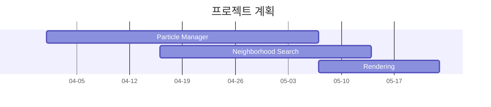


# Particle System을 활용한 효과 구현
 
##  List Up

### 참고영상
- https://www.youtube.com/shorts/AYhJBuNHC9k
- https://www.youtube.com/watch?v=f2TYIinAf2E

### 기능 구현
1. 3D Particle Manager 구현

	- 여러 파티클 Emitter을 하나의 Manager가 관리하고, 각 Emitter가 생성 / 삭제되는 과정에서 발생할 수 있는 GPU 오버헤드(메모리 할당 등)를 줄이기 위하여 Particle을 Pooling하는 방식으로 구현 

	- Append Buffer의 카운터를 활용하여 Indirect Draw Call을 지원하여 렌더링 파이프라인에서 발생할 수 있는 오버헤드 최소화 

	- 시간에 종속한 변수(Emission Rate / Life Time / Size)를 사용자가 변경할 수 있도록 구현

2. 입자 간 인력/척력이 있을 경우, 전체 입자에 대해 연산하지 않고 영향을 받을 수 있는 입자를 찾는 Neighborhood Particle Search 알고리즘 구현
3. Particle 및 Emitter에 대한 Rendering 기능 구현
	- Motion Blur / Glow 등으로 사실적인 렌더링 구현

## 프로젝트 계획

## 프로젝트 일지

### 25.04.02
- Pooling 관련 자료 리서치 수행
	- 자료 : [Particle effect system for the needs of a modern video game using the GPU(Techland, 2016)](https://yadda.icm.edu.pl/baztech/element/bwmeta1.element.baztech-80fb5d33-b7e4-4e03-83d1-a6368816caa4/c/Particle_effect_.pdf)

	- 내용
		- Denotations
			- $G_{sim}$ : 스레드 그룹 개수
			- $P_{prev}$ : 이전 프레임에서 파티클 수
			- $P_{curr}$ :  최근 프레임에서 파티클 수
			- $Th_{opt}$ : 그룹당 스레드 개수(일반적으로 64를 사용)
			- $Set_{S}$ : 다른 파티클을 생성할 수 있는 파티클을 포함하는 세트
			- $Set_{D}$ : 최근 프레임에서 죽은 파티클을 포함하는 세트

		- 2단계에 거친 알고리즘으로 Particle에 대한 Pooling 구현
			1. First Stage
				- 메인 버퍼의 파티클 개수 파악 및 Thread Group 개수 선정
					- $G_{sim} = ceil(\frac{P_{prev}}{Th_{opt}})$
				- 매 프레임 시작 시 $Set_{S}$와 $Set_{D}$를 설정
				- 입자 방출 과정에서 $Set_{D}$가 비어있다면, $P_{curr}$ 를 새로운 파티클의 인덱스로 지정하고 증가시키고, 비어있지 않다면  $Set_{D}$에 설정된 죽은 파티클의 인덱스를 활용
				- Defragmentation 수행
					- $Set_{D}$에 있는 파티클을 Consume하고, 해당 파티클의 인덱스에 $P_{curr}$ 파티클 부터 채워나감
			2. Second Stage
				- Culling 수행(이 프로젝트에서는 별도 구현하지 않음)
				- Bitonic Sort나 Radix Sorting을 통한 렌더링 방법 & 깊이 값 기준 정렬
				- 렌더링 기법 N개에 따른 DrawInstancedIndirect 수행

- DirectX11를 활용한 테스트 기본 환경 구축(Camera 클래스 등 작성)

### 25.04.03
- 알파 블렌딩을 활용하여 불투명한 물체와 겹쳐 그릴 시 파티클이 투명하게 반영되도록 구현 
	- Z 인덱스에 따라 순차적으로 그려지지 않을 경우 왜곡이 발생([Issue #1](https://github.com/jooyounghan/ProjectA/issues/1)로 관리)
- ParticleManager 클래스 작성 중
	- DrawIndexedInstanced를 바탕으로 Emitter 디버그 Cube 그리기 기능 

### 25.04.04 ~ 25.04.06
- AppendBuffer를 통한 SetD(죽은 파티클에 대한 세트) 구성 수행
- 간단한 상황 예제 작성을 통하여 Set 구성, Sourcing, Simulation 수행(테스트 용으로 간이로 작성)
- 알고리즘 수정 정리
	- 기존 알고리즘에서 Prefix Sum을 활용한 방법 추가
	 

### 25.04.07
- Prefix Sum 관련 알고리즘 정리
	- 자료
		1) [Single-pass Parallel Prefix Scan with Decoupled Look-back(NVidia, 2016)](https://research.nvidia.com/sites/default/files/pubs/2016-03_Single-pass-Parallel-Prefix/nvr-2016-002.pdf)
		2) [Prefix Sums and Their Applications](https://www.cs.cmu.edu/~guyb/papers/Ble93.pdf)
	- Prefix를 구하기 위해서는 블록 단위로 로컬 Prefix Sum을 계산하고, 이를 모든 블록에 대해 전파하여야한다. 후자의 방식에는 3가지가 존재한다.
		1) Scan-Then-Propagate
			각 블록 단위로 로컬 Prefix Sum을 계산하고, 각 블록은 이전 블록들의 합계를 참조하여 자신의 로컬 Prefix 합에 더함으로써 최종 결과를 얻는다.
		2) Reduce-then-scan
			각 블록 단위로 전체 합계(Reduction)을 계산하고 이를 별도의 버퍼에 저장한다.
			이후 블록 단위 전체 합계가 저장된 버퍼에 대해 Prefix 합을 계산한다.
			각 블록은 자신의 로컬 Prefix 합을 계산한 후, 블록 합계의 Prefix 합을 더하여 최종 글로벌 Prefix 합을 계산한다.
		3) Chained-Scan
			각 블록 단위로 로컬 Prefix Sum을 계산하되, 이전 블록의 프리픽스 값을 참조하여 자신의 결과에 더하므로 블록이 순차적으로 이전 블록을 기다려야한다.

	- 이 프로젝트에서는 블록 단위 로컬 Prefix Sum을 계산하기 위하여 Blelloch 알고리즘을 채택하고, 모든 블록에 대한 전파를 위하여 Chained-Scan 방식을 활용하되, Decoupled Look-back 방식을 채택하여 효율성을 높인다.
- 블록 단위 로컬 Prefix Sum 계산 알고리즘 구현 및 검증 수행
